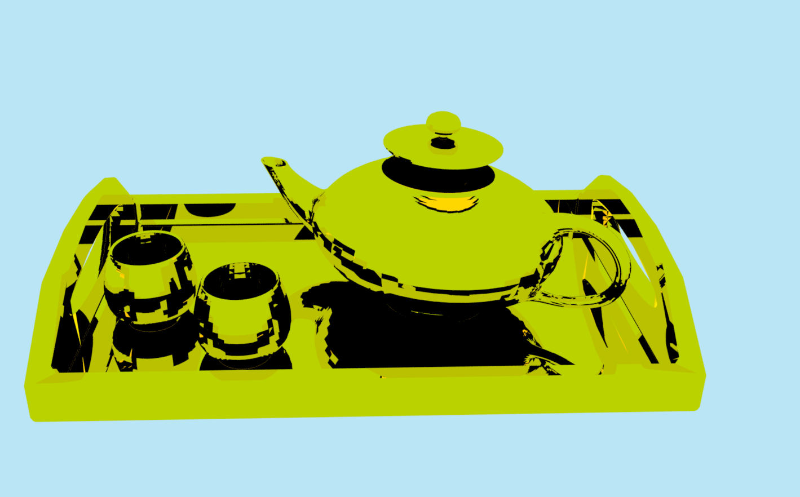
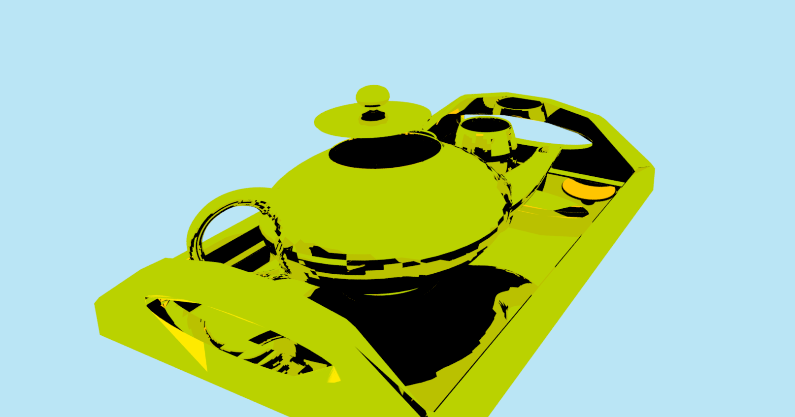

Path tracer mit vulkan. Momentan ist noch kein Denoising implementiert, aus diesem Grund berechnen die Shader 32 Strahlen pro pixel, um visuelles Rauschen zu vermeiden. 
Für jeden Pixel werden maximal 3 Bounces simuliert. Weil 32 Samples ziemlich aufwendig sind, werden in diesem Programm ca. 40-60 FPS auf einem Rechner mit RTX 4060 bei einer Auflösung von 1920x1080 erreicht.

Diffuse Reflektion mit wenig Rauheit (0.001 in scatter.glsl)

